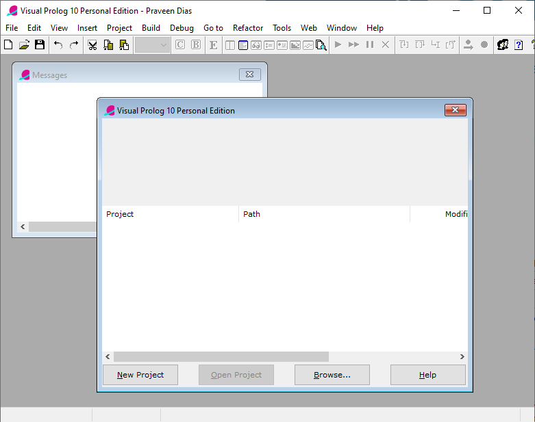
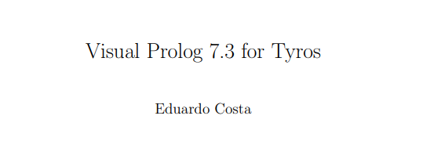
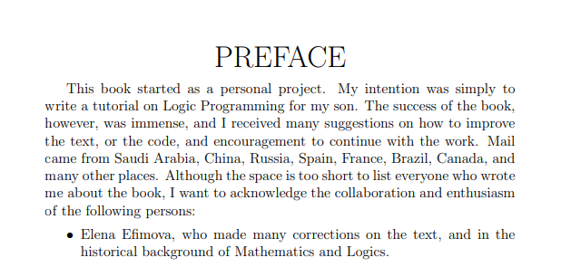

# Visual Prolog

Visual Prolog, previously known as PDC Prolog and Turbo Prolog, is a strongly typed object-oriented extension of Prolog. As Turbo Prolog, it was marketed by Borland but it is now developed and marketed by the Danish firm PDC that originally created it. Visual Prolog can build Microsoft Windows GUI-applications, console applications, DLLs (dynamic link libraries), and CGI-programs. It can also link to COM components and to databases by means of ODBC.

Visual Prolog contains a compiler which generates x86 machine code. Unlike standard Prolog, programs written in Visual Prolog are statically typed. This allows some errors to be caught at compile-time instead of run-time time.

https://en.wikipedia.org/wiki/Visual_Prolog

# Visual Prolog 7.3 for Tyros

You can find a copy of this book in this repository.

More books: https://wiki.visual-prolog.com/index.php?title=Category:Books

# Book for the Son

